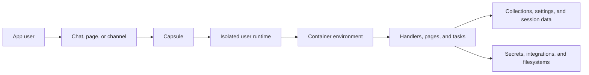

When people ask what a Capsule app actually is, the shortest answer is: it is a self contained definition for an AI product.

That sounds simple, but it has a few consequences. The same `App` definition can describe the runtime, the chat handler, the queue page, the background jobs, the mounted storage, and the channels the app shows up in. `capsule serve` and `capsule deploy` both read from that same source of truth.

Deploying the app also gives you a hosted product surface with its own authenticated users. The app definition is not just "the backend." It is the thing Capsule uses to run the actual product.

The idea is that each app user gets an isolated sandboxed runtime. Your code runs with its declared image, packages, secrets, integrations, and mounted filesystems, so an agent can read and write files, run background work, call tools, and serve pages as part of one application.

## How a real app is split

Most non-trivial Capsule apps settle into four layers:

- the app shell, which declares runtime, integrations, collections, settings, and pages
- workflow surfaces, where users review queues, data, or task state
- assistant logic, which routes requests and answers questions
- background work, which keeps the product moving without blocking chat

That split is useful because it tells you where new features should land. If a feature needs durable records, it probably belongs in a collection. If it needs operator review, it probably wants a page. If it needs async work or side effects, it probably wants a task or schedule.

## One app definition, many product surfaces

Unlike a split stack where chat, background jobs, file storage, and UI all live in different systems, Capsule lets one app expose multiple surfaces at once:

- built-in web chat
- named external channels
- API endpoints
- Python DSL pages
- React pages
- scheduled jobs
- background tasks

All of that is packaged off the same `App` definition. In practice, this means you can read one file and understand the shape of the product.

## Runtime per app user

Capsule runs the app inside a managed runtime per app user. You do not have to invent your own execution layer for sessions, channel traffic, tasks, page-backed interactions, or user-specific filesystem work.

That runtime is sandboxed and container-like: it has the environment specified in `Image(...)`, access to declared secrets and integrations, and any filesystems you mount. This is what lets Capsule apps do more than answer a prompt. They can keep working across chat, pages, tasks, schedules, generated files, uploads, and review flows.

The same runtime model powers local iteration with `capsule serve`, hosted deploys with `capsule deploy`, and the channel-facing versions of the app. The main thing that changes is where the requests come from, not what kind of app you are writing.

## App-scoped users

When you deploy a Capsule app, users sign into that app. They do not land in one shared global user pool across every Capsule project.

That distinction matters because `access="authenticated"` pages, data handlers, and session context are all scoped to the deployed app. Two Capsule apps can have different user pools, different access policies, and different user-scoped data even if the same email signs into both.

## Runtime flow

## What `capsule serve` and `capsule deploy` read

When you run `capsule serve app:app` or `capsule deploy app:app`, Capsule resolves the app entry point and serializes the app configuration. That includes:

- `image` and package installs
- declared pages
- data handler names
- collection declarations
- settings metadata
- integrations
- schedule specs
- filesystems and secrets

A single source file can describe both local iteration and production deploys. You are not maintaining a separate deployment manifest that slowly drifts away from the actual app.

## Handler types

Most apps end up with a small mix of handler types:

- message handlers for chat or API conversations
- lifecycle hooks like `boot`, `shutdown`, `enter`, and `exit`
- tasks for asynchronous background work
- schedules for cron-triggered jobs
- endpoints and ASGI mounts for HTTP surfaces

Each one runs inside the same Capsule runtime with the right context injected. A schedule is not a different app. A page data handler is not a different service. They are just different entry points into the same product.

## Where should a new feature live?

This is the design question people hit most often.

As a rule of thumb:

- put conversational interpretation in `@app.message()`
- put durable records in collections
- put operator controls in settings and pages
- put external side effects and long work in tasks
- put recurring maintenance in schedules

If you find yourself stuffing all of that into one long message handler, the app usually wants to be split across these surfaces instead. That is not a Capsule quirk. It is just what happens when the app starts doing real work.

## State layers

There are three main kinds of state in Capsule:

- `session.data` for per-conversation key-value state
- collections for durable document storage
- settings for scoped configuration values that can be edited through the UI

Use the lightest one that fits the problem:

- `session.data` for ephemeral conversation context
- collections for real data models
- settings for configuration, not records

## UI layers

Capsule has two page models:

- the Python DSL, where a page returns `cpsl.ui.Page([...])`
- React pages registered with `app.add_page(...)`

Both can consume the same data handlers and collections. That is what lets an app start with a simple dashboard and later grow into a richer workflow page without having to rebuild the backend shape.

## Product and deploy knobs live in code

Operational concerns are part of the app definition, not an afterthought. The same code can describe things like:

- `Image(...)` controls Python packages, apt packages, and setup commands
- `price` and `pricing_type` describe how the app is sold
- `keep_warm_seconds` affects runtime readiness
- `filesystems` and `secrets` connect external state
- `channels` decide where the app can talk to users

This is one of Capsule's main bets: the deploy story should stay close to the app code instead of turning into a second configuration project.

## Related pages

- [Why Capsule](/concepts/why-capsule)
- [First Chat App](/build/first-chat-app)
- [App Styles](/concepts/app-styles)
- [Collections](/features/collections)
- [Tasks And Schedules](/features/tasks-and-schedules)
- [App API Reference](/reference/app-api)
