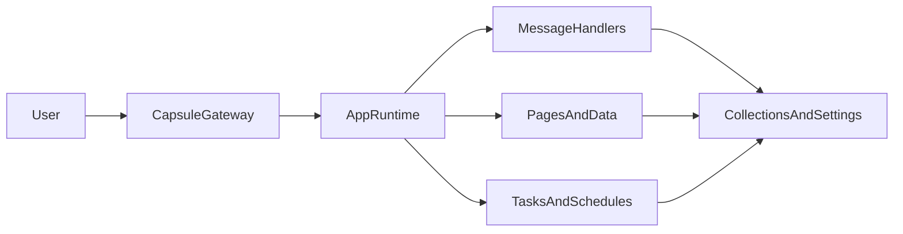

Capsule treats your Python code as both an application definition and a deployment spec.

At the center is `cpsl.App`, which collects:

- runtime image requirements
- message, task, schedule, and HTTP handlers
- pages and data handlers
- collections and settings
- integrations, secrets, and filesystems
- pricing and keep-warm behavior

## One object, many surfaces

Unlike a split stack where chat, background jobs, and UI all live in different systems, Capsule lets one app expose multiple surfaces at once:

- chat
- API endpoints
- Python DSL pages
- React pages
- scheduled jobs
- background tasks

All of that is packaged off the same `App` definition.

## Runtime flow

## What `capsule serve` and `capsule deploy` read

When you run `capsule serve app:app` or `capsule deploy app:app`, Capsule resolves the app entry point and serializes the app configuration:

- `image` and package installs
- declared pages
- data handler names
- collection declarations
- settings metadata
- integrations
- schedule specs
- filesystems and secrets

That is why a single source file can fully describe both local iteration and production deploys.

## Handler types

Capsule apps can contain several kinds of executable logic:

- message handlers for chat or API conversations
- lifecycle hooks like `boot`, `shutdown`, `enter`, and `exit`
- tasks for asynchronous background work
- schedules for cron-triggered jobs
- endpoints and ASGI mounts for HTTP surfaces

Each handler runs inside the Capsule runtime with the appropriate context injected.

## State layers

There are three main kinds of state in Capsule:

- `session.data` for per-conversation key-value state
- collections for durable document storage
- settings for scoped configuration values that can be edited through the UI

Use the lightest tool that fits the problem:

- `session.data` for ephemeral conversation context
- collections for real data models
- settings for configuration, not records

## UI layers

Capsule has two page models:

- the Python DSL, where a page returns `cpsl.ui.Page([...])`
- React pages registered with `app.add_page(...)`

Both can consume the same data handlers and collections.

## Deploy knobs live in code

Operational concerns are part of the app definition, not an afterthought:

- `Image(...)` controls Python packages, apt packages, and setup commands
- `price` and `pricing_type` describe how the app is sold
- `keep_warm_seconds` affects runtime readiness
- `filesystems` and `secrets` wire in external state

## Related pages

- [App Styles](/concepts/app-styles)
- [Collections And Data](/concepts/collections-and-data)
- [Tasks And Scheduling](/concepts/tasks-and-scheduling)
- [App API Reference](/reference/app-api)
