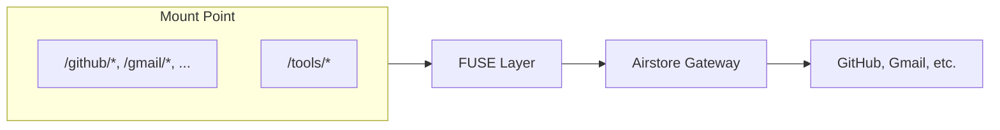

Once mounted, your source views appear as directories at `~/airstore/`. This page covers how to mount, unmount, and troubleshoot common issues.

## Cloud mode (default)

If you're using Airstore Cloud, mounting is simple:

```bash
airstore mount ~/airstore
```

Your source views and tools appear automatically:

```bash
ls ~/airstore/
# linear/  github/  gmail/  tools/

ls ~/airstore/linear/design-issues/
# AGE-71_Spike_Figure_out_chat_UX.md
# AGE-57_Table_layout_gets_cut_off_sometimes.md
```

No config file needed—everything is configured in the [dashboard](https://app.airstore.ai).

## How mounting works

Airstore uses FUSE (Filesystem in Userspace) to present a virtual filesystem:



1. You mount to a directory (e.g., `~/airstore`)
2. File reads go through the FUSE layer
3. FUSE forwards requests to the Airstore gateway
4. Gateway fetches data from connected services
5. Content is returned as file data

The filesystem is **virtual**—files don't exist on disk until you read them.

## Filesystem structure

When mounted, Airstore exposes your source views and tools:

```
~/airstore/
├── sources/
│   ├── linear/
│   │   └── design-issues/     # Source view
│   ├── github/
│   │   └── open-prs/          # Source view
│   └── gmail/
│       └── invoices/          # Source view
└── tools/
    ├── github                 # MCP tool
    ├── linear                 # MCP tool
    └── gmail                  # MCP tool
```

## Mount options

```bash
# Standard cloud mount
airstore mount ~/airstore

# With verbose logging
airstore mount ~/airstore --verbose
```

| Option | Description |
|--------|-------------|
| `--verbose`, `-v` | Enable verbose logging for debugging |

## Unmounting

Press `Ctrl+C` in the terminal where mount is running to gracefully unmount:

```
^C
  Unmounting...
✓ Unmounted
```

If the mount doesn't respond, press `Ctrl+C` again to force exit.

You can also unmount using system commands:

```bash
# macOS
diskutil unmount ~/airstore

# Linux
fusermount -u ~/airstore
```

## Troubleshooting

**Mount fails with "FUSE not found"**

Re-run the install script, which handles FUSE installation:

```bash
curl -sSL https://airstore.dev/install.sh | sh
```

**Mount point is not empty**

The mount directory must be empty or not exist:

```bash
rm -rf ~/airstore
airstore mount ~/airstore
```

**Permission denied**

On Linux, you may need to be in the `fuse` group:

```bash
sudo usermod -aG fuse $USER
# Log out and back in
```

## Local mode

For self-hosted deployments or development, you can run Airstore in local mode with your own MCP servers. See the [Local Deployment Guide](/deployment/local) for details.

## Related

- [Source Views](/concepts/source-views) - Create views of your data
- [Tools](/concepts/tools) - Run MCP tools as executables
- [CLI Reference](/reference/cli) - Full command documentation
