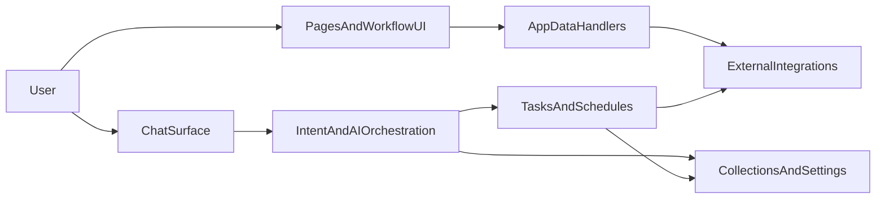

The easiest way to understand Capsule is to stop thinking about isolated features and start thinking about the shape of a real product.

A real Capsule app is usually not just:

- one model call
- one callback
- one chat handler

It is an app shell, a few workflow surfaces, some background work, and an assistant that helps users move through the workflow.

This page uses a real-world Capsule app as the mental model, but keeps the explanation generic so you can map the pattern onto your own product.

## The shape of a real app

Here is the important idea:



The assistant is only one part of the system. Capsule lets all of those parts live in the same app definition.

## 1. The app shell defines the product

In a real app, `cpsl.App(...)` is where the product comes together:

```python
import cpsl
import cpsl.ui as ui

app = cpsl.App(
    name="ops-outreach",
    image=cpsl.Image(python_packages=["baml-py", "requests"]),
    channels=[cpsl.Chat()],
    secrets=["ANTHROPIC_API_KEY"],
)

app.add_integration(
    "gmail",
    client_id=cpsl.Secret.from_name("GOOGLE_OAUTH_CLIENT_ID"),
    client_secret=cpsl.Secret.from_name("GOOGLE_OAUTH_CLIENT_SECRET"),
    scopes=["https://www.googleapis.com/auth/gmail.modify"],
)

leads = app.collection("leads", columns=["company", "status", "thread_id"], scope="owner")
app.setting("auto_outreach", scope="owner", type=bool, default=False)

@app.page("Overview", icon="layout-dashboard")
def overview():
    return ui.Page([...])

app.add_page("Mailbox", icon="mail", component="pages/mailbox.tsx")
```

You do not need to copy this literally. The point is the structure:

- the runtime lives here
- integrations live here
- state lives here
- settings live here
- pages live here
- the assistant logic plugs into the same app

That is the first big Capsule idea. You are not gluing together five different systems before you can ship something useful.

## 2. Pages are workflow surfaces, not marketing pages

Real AI products usually need at least two kinds of UI:

- a high-level dashboard for status, settings, and task visibility
- one or more workflow pages where operators actually review, triage, or act on data

In the reference app, the overview page uses:

- `ui.Toggle(...)` for operator settings
- `ui.Metric(...)` for status
- `ui.TaskBoard(...)` for background work visibility

And then the app adds a dedicated mailbox page as a custom React surface.

That split shows up over and over in good Capsule apps:

- use the Python DSL for dashboards, tables, settings, and lightweight workflow UI
- use a React page when the product needs something richer, like a mailbox, queue, or review surface

## 3. `@app.data(...)` powers product UI

Many real apps need pages that talk to external systems. Capsule's `@app.data(...)` handlers are the bridge between product UI and runtime logic.

That can look like this:

```python
@app.data("threads", access="authenticated")
async def get_threads(ctx: cpsl.RequestContext, status: str = ""):
    creds = ctx.integrations.get("gmail")
    if not creds:
        return {"threads": [], "gmail_connected": False}

    gmail = GmailClient(creds.access_token)
    ...
    return {"threads": threads, "gmail_connected": True}
```

The important thing to notice is that this is not a random helper function. It is a product endpoint:

- it knows who the caller is through `RequestContext`
- it can use the caller's connected integrations
- it can feed a workflow page directly

This is how you build things like inboxes, approval queues, review panels, dashboards, and operator tools inside the same app as the assistant.

## 4. Chat is an orchestrator

In toy apps, chat is the whole app.

In real apps, chat is often the orchestrator that decides what should happen next.

A strong pattern looks like this:

```python
@app.message()
async def handle(session: cpsl.Session, msg: cpsl.Message):
    data_context = await build_data_context()
    intent = await b.ClassifyIntent(message=msg.text, data_context=data_context)

    if intent.intent == ChatIntent.START_OUTREACH:
        await run_outreach.submit(session=session)
        return

    if intent.intent == ChatIntent.CHECK_STATUS:
        await session.reply(await build_status_summary())
        return

    stream = b.stream.Chat(
        messages=session.chat_messages(msg, cls=ChatMessage),
        system_prompt=SYSTEM_PROMPT,
        data_context=data_context,
    )
    await session.stream_reply_from(stream)
```

This is the second big Capsule idea:

- the assistant can route
- the assistant can trigger deterministic product actions
- the assistant can still fall through to a normal streamed answer

That is much closer to how useful AI products behave in practice.

## 5. Tasks and schedules run the operational loop

Real apps almost always need work that should not happen inline inside a chat turn:

- sending outreach
- syncing systems
- polling inboxes
- generating reports
- processing attachments

Capsule tasks and schedules are how that work stays inside the product instead of being shoved into a separate stack.

In a production-shaped app, a common loop is:

1. chat or page action submits a task
2. task talks to integrations and updates collections
3. the dashboard or workflow page reflects the new state
4. a schedule keeps the system moving in the background

`TaskBoard` matters because it makes that asynchronous work visible to the operator instead of hiding it in logs.

## 6. AI does judgment, Python does control

This is the most important mindset shift.

In a solid Capsule app:

- AI handles classification, drafting, extraction, and analysis
- Python handles filters, retries, limits, state transitions, scheduling, and external I/O

That split is what keeps the product predictable.

A good rule of thumb:

- if the job is "understand or generate language," reach for the model
- if the job is "decide whether we are allowed to do this, how many rows to process, when to retry, or what status to store," keep that in ordinary code

## 7. What to copy from this pattern

You do not need to build an outreach tool to use Capsule well. But you probably do want to copy these habits:

- put your product shape on `App(...)` early
- add collections and pages sooner than you think
- treat chat as one surface, not the whole product
- use `@app.data(...)` for integration-backed workflow pages
- keep task logic observable with `TaskBoard`
- let AI do interpretation and drafting, but keep business control flow deterministic

## Where to go next

- [Quickstart](/quickstart)
- [First Chat App](/build/first-chat-app)
- [Data Handlers And Pages](/tutorials/data-handlers-and-pages)
- [App Model And Runtime](/concepts/app-model-and-runtime)
- [UI And Pages Reference](/reference/ui-and-pages)
